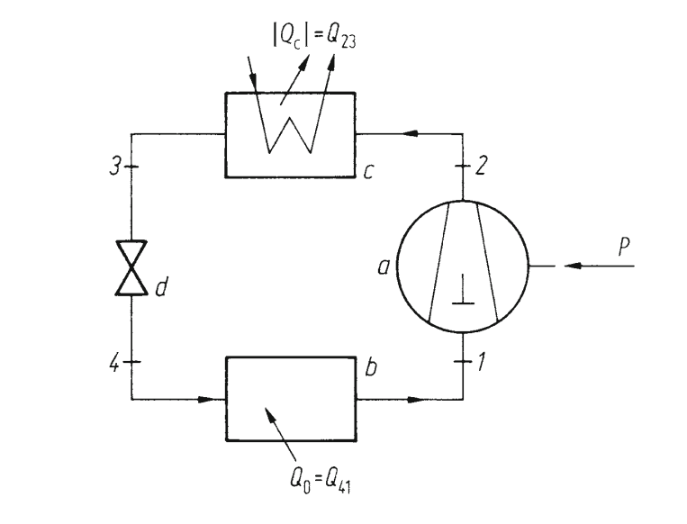

<!-- omit in toc -->
# Demomodell 
<!-- omit in toc -->
# Table of Contents 
- [Overview](#overview)
- [Demomodel Description](#demomodel-description)
- [System Boundaries](#system-boundaries)
- [Components](#components)
  - [CHP Units](#chp-units)
  - [Heat Pump](#heat-pump)
  - [Energy Storage Systems](#energy-storage-systems)
- [Topology](#topology)

## Overview
This model demonstrates the optimization of an industrial energy system with focus on sector coupling between power and heat. 

It includes:
- Combined heat and power units (CHP)
- Heat Pumps
- Solar Thermal Collector
- Battery & Heat Storage
- Grid Connections (Power, Heat, Waste Heat)

## Demomodel Description

## System Boundaries 

- Mixed-lineare programming approach
- Perfect forecast
- Hourly resolution
- No transmission losses
- No ramp rates 

## Components 

### CHP Units
- Two identical units
- Fixed hydrogen admixture (0-100%)
  
### Heat Pump
Technical specifications:
- Working fluid: R-717 (Ammonia)
- Single-stage compression cycle
- Minimum temperature difference: 10 K
- No subcooling or desuperheating

*Figure 1: Schematic representation of the heat pump cycle with main components: compressor (a:1→2), condenser (c:2→3), expansion valve (d:3→4) and evaporator (b:4→1)*

Thermodynamic assumptions:
1. Isentropic compression
2. Isobaric heat rejection
3. Isothermal/isobaric heat rejection through condensation
4. Isenthalpic expansion through throttle valve
5. Isothermal/isobaric heat absorption in evaporator

### Energy Storage Systems

- Perfect charging/discharging
- No losses
- No cyclic degradation

## Topology

*
  Figure 2: Schematic Topology of the Demomodel*

**Ports:**

power_in: 
power_out:hn

heat_in: 
heat_out:

waste_heat_in:
waste_heat_out:

